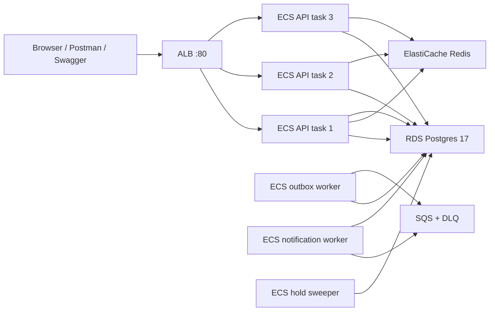

# AWS infrastructure — what runs and why

Region: **`ap-south-1` (Mumbai)**. Source of truth: [`infra/lib/careflow-stack.ts`](../infra/lib/careflow-stack.ts).
Do not click-create ECS/RDS/SQS in the console; the next `cdk deploy` will fight you.

This is a **few-day showcase** sized to match the product (three API tasks, Postgres as the
booking authority) without paying for NAT Gateways, Multi-AZ RDS, or a custom domain. Tear it
down with `make aws-destroy` when the demo is over.

First-time account steps (IAM, secrets, bootstrap): [`05-aws-first-deploy.md`](05-aws-first-deploy.md).

---

## How a request moves



Local Docker Compose is the same shape: nginx stands in for the ALB, three `api-*` containers
stand in for the API service, LocalStack stands in for SQS.

---

## Services in use

### Networking

| Service | What we created | Why |
| --- | --- | --- |
| **VPC** | 2 AZs, public + isolated subnets, **no NAT Gateway** | Isolate RDS/Redis from the internet. Skip NAT (~$32/month) because this stack only lives a few days. |
| **Internet Gateway** | Attached to the VPC | ALB and Fargate need a path to the internet (pull images, talk to SQS / Secrets Manager / CloudWatch). |
| **Public subnets** | ALB + ECS Fargate (`assignPublicIp: ENABLED`) | Fargate with a public IP can reach AWS APIs without NAT or VPC interface endpoints. |
| **Isolated subnets** | RDS + Redis, no public IP | Data plane is not reachable from the internet. Only the task security group may connect on 5432 / 6379. |
| **Security groups** | `AlbSg` (80 from the world), `TaskSg` (3000 from ALB only), `DataSg` (Postgres/Redis from tasks only) | Least-privilege at the network edge. Workers do not accept internet traffic. |
| **Application Load Balancer** | Internet-facing, HTTP :80 | One DNS name in front of three API tasks, health checks on `GET /health`, rolling deploys without clients pinning a task. No ACM cert: you use the ALB DNS name directly. |

HTTPS is optional: pass `--context certificateArn=…` and the stack adds a 443 listener. Without a
domain that was skipped on purpose.

### Compute

| Service | What we created | Why |
| --- | --- | --- |
| **ECS Fargate cluster** | One cluster | No EC2 to patch. Matches the assignment’s “three instances” without SSH. |
| **API service** | **desired count 3**, 0.25 vCPU / 512 MB each, circuit breaker + rollback | Any task can serve any request. Booking correctness lives in Postgres, not in process memory. Circuit breaker rolls a bad image back. |
| **Outbox worker** | 1 task | Polls `outbox_events` `FOR UPDATE SKIP LOCKED` and publishes to SQS. Separate process so a crash here cannot take the API with it. |
| **Notification worker** | 1 task | Consumes SQS, idempotent on `processed_messages`. Today it **logs**; SES/Twilio are not wired. |
| **Hold sweeper** | 1 task | Marks lapsed holds `EXPIRED`. Hygiene, not correctness — create-hold already reclaims expired rows. |
| **Migrate task definition** | One-shot Fargate task (`migrate` + `seed`) | Schema changes never run inside the API. Three tasks racing `CREATE INDEX` is an outage. `make aws-migrate` is `ecs run-task` against this family. |

One Docker image, four commands (`dist/main.js` vs the three workers). API and workers cannot
drift to different application versions.

Fargate is **x86_64**. Laptop deploys build `linux/amd64` (QEMU on Apple Silicon). CI on
`ubuntu-latest` builds that natively.

### Data and async

| Service | What we created | Why |
| --- | --- | --- |
| **RDS PostgreSQL 17** | `db.t4g.micro`, single-AZ, 20 GB, encrypted, not publicly accessible | **Source of truth** for appointments, holds, idempotency. GiST exclusion constraints make double-booking impossible even when three tasks write at once. Single-AZ is a cost choice for a short demo, not an HA choice. |
| **ElastiCache Redis 7** | `cache.t4g.micro`, one node, isolated subnet | Rate limits and schedule **cache only**. Booking never consults Redis. If Redis dies, `/ready` reports it and the API keeps serving (in-process limiter). |
| **SQS** | Standard queue + DLQ, 60s visibility timeout | Durable at-least-once delivery for outbox events. A notification outage must not fail a committed booking. |
| **Secrets Manager** | `careflow/jwt` (you generated) + RDS-generated password | ECS injects `JWT_SECRET` and `DB_PASSWORD`. There is no `.env` on the tasks. Access keys are not stored in GitHub. |

### Delivery and ops

| Service | What we created | Why |
| --- | --- | --- |
| **ECR** | Repository `careflow` | Immutable images. CI will push `careflow:<git-sha>`. The first laptop deploy used a CDK Docker asset; later deploys with `--context imageTag=<sha>` pull from this repo. |
| **CloudWatch Logs** | One log group, 7-day retention | API + workers + migrator. Cheap enough to keep for the demo; destroy with the stack. |
| **IAM task role** | Send/receive SQS | Runtime identity. The SDK uses this role, not `AWS_ACCESS_KEY_ID`. |
| **IAM execution role** | Pull ECR, read secrets, write logs | What ECS needs **before** the process starts. |
| **CDK bootstrap (`CDKToolkit`)** | S3 + IAM roles CDK itself uses | One-time per account/region. Not the Careflow product stack. |

---

## What we deliberately did not use

| Not used | Why not, for this showcase |
| --- | --- |
| **NAT Gateway** | Cost. Public IP on Fargate replaces it. A longer-lived production stack should move tasks to private subnets + NAT or interface endpoints. |
| **VPC interface endpoints** | Same reason: several endpoints cost more than four days of NAT. |
| **ACM + Route 53** | No domain. HTTP ALB DNS is enough to demo. HSTS / `upgrade-insecure-requests` are off while `COOKIE_SECURE=false`. |
| **WAF** | Extra cost; this is a short public demo, not a hardened edge. |
| **RDS Multi-AZ / Redis replica** | HA for a week of showcase is not worth 2× the data bill. |
| **ECS on EC2** | Server patching with no benefit for three tasks. |
| **Lambda for the API** | Long-running, connection-heavy booking API; Fargate matches the three-instance model cleanly. |
| **SES / Twilio** | Outbox path is real; the consumer logs. Wiring a vendor is a product choice, not a deploy blocker. |
| **S3 / CloudFront** | Frontend is a separate repo. |

---

## Mapping to the local stack

| Local (`make up`) | AWS |
| --- | --- |
| nginx :8080 | ALB DNS :80 |
| `api-1` / `api-2` / `api-3` | ECS API desired count 3 |
| `worker-outbox` / `notifications` / `sweeper` | Three ECS worker services |
| Postgres 17 container | RDS Postgres 17 |
| Redis 7 container | ElastiCache Redis 7 |
| LocalStack SQS | SQS |
| `./.env` (gitignored, localhost) | Secrets Manager + task env (`runtime-config.ts`) |

---

## CI/CD (written, not yet connected to this account)

Workflows live in [`.github/workflows/`](../.github/workflows/) and assume **this backend folder
is the GitHub repo root**.

| Workflow | When | What it does | AWS needed? |
| --- | --- | --- | --- |
| **PR** (`pr.yml`) | Pull request / push to `main` | Typecheck, lint, unit, `npm audit`, OpenAPI drift, integration/concurrency/e2e vs Postgres 17, Docker build, Trivy HIGH/CRITICAL | No |
| **Deploy** (`deploy.yml`) | Push to `main` or manual | Push image to ECR → gated `ecs run-task` migrate (must exit 0) → `cdk deploy` with `imageTag=$GITHUB_SHA` → smoke `/health` `/ready` | Yes: GitHub OIDC role `AWS_DEPLOY_ROLE_ARN` |

Until the backend is its own GitHub repo **and** that OIDC role exists, deploys stay on the
laptop (`make aws-deploy`). Do not push to `main` with the Deploy workflow enabled unless that
secret is set — the job will fail on `sts:AssumeRoleWithWebIdentity`.

OIDC setup is in [`05-aws-first-deploy.md`](05-aws-first-deploy.md) § GitHub OIDC.

---

## Live endpoints (this showcase)

Replace with the current stack output if the ALB was recreated:

| | |
| --- | --- |
| API | `http://Carefl-Alb16-n1MsOwFTsyTK-1345249308.ap-south-1.elb.amazonaws.com` |
| Swagger | `…/docs` |
| Health | `…/health` |
| Ready | `…/ready` (database + Redis) |

Seeded password: `Careflow!2026`. After `/docs` loads, Authorize with the `accessToken` from login.

---

## Cost and teardown

Expect **about $15–25 for four days** (ALB, 6 Fargate tasks, `db.t4g.micro`, `cache.t4g.micro`,
public IPv4). It keeps billing until:

```bash
export AWS_PROFILE=careflow
make aws-destroy
```

`careflow/jwt` in Secrets Manager is **not** in the CDK stack (it was created by
`make aws-secrets`). Delete it in the console if you want it gone too.
